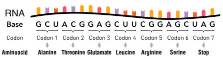
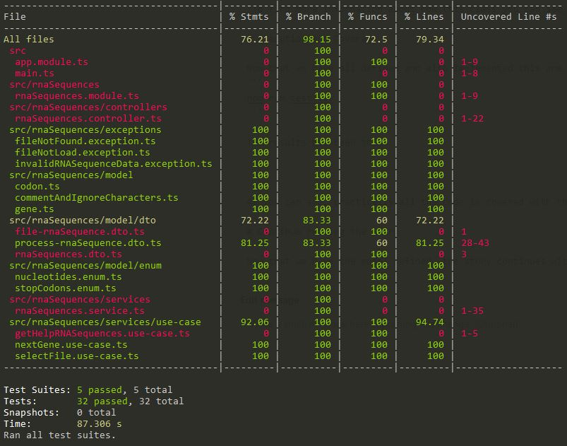

<p align="center">
  <a href="http://nestjs.com/" target="blank"></a>
</p>

[circleci-image]: https://img.shields.io/circleci/build/github/nestjs/nest/master?token=abc123def456
[circleci-url]: https://circleci.com/gh/nestjs/nest

  <p align="center">A progressive <a href="http://nodejs.org" target="_blank">Node.js</a> framework for building efficient and scalable server-side applications.</p>
    <p align="center">
<a href="https://www.npmjs.com/~nestjscore" target="_blank"></a>
<a href="https://www.npmjs.com/~nestjscore" target="_blank"></a>
<a href="https://www.npmjs.com/~nestjscore" target="_blank"></a>
<a href="https://circleci.com/gh/nestjs/nest" target="_blank"></a>
<a href="https://coveralls.io/github/nestjs/nest?branch=master" target="_blank"></a>
<a href="https://discord.gg/G7Qnnhy" target="_blank"></a>
<a href="https://opencollective.com/nest#backer" target="_blank"></a>
<a href="https://opencollective.com/nest#sponsor" target="_blank"></a>
  <a href="https://paypal.me/kamilmysliwiec" target="_blank"></a>
    <a href="https://opencollective.com/nest#sponsor"  target="_blank"></a>
  <a href="https://twitter.com/nestframework" target="_blank"></a>
</p>
  <!--[](https://opencollective.com/nest#backer)
  [](https://opencollective.com/nest#sponsor)-->

## Description


*Image from "[RNA-codons-aminoacids,](https://commons.wikimedia.org/wiki/File:RNA-codons-aminoacids.svg)" by Thomas Splettstoesser. Image is licensed under a [CC BY-SA 4.0](http://creativecommons.org/licenses/by/4.0/) license*

This project is a backend appplication to process files of RNA Sequences as a part of the Code Challenge Processing mRNA of [Capgemini](https://www.capgemini.com/).

This sequence of mRNA is broken into a series of three-nucleotide units known as “codons”. The three-letter nature of codons means that the four nucleotides found in mRNA — called A, U, G, and C — can produce a total of 64 different combinations.

Genes are defined by a sequence of what could be many hundreds of codons. Each gene contains a 'start codon' which indicates where it begins and a 'stop codon' which defines where the gene ends. Start codons can vary according to the species but there are commonly three possible stop codons: UAG, UGA and UAA.

This application let you to select a file to be analyzed and them you can request to read and analyze the file until retrieve the next valid gene, then you can request the next gene until the file is finished.

The application has three endpoints:

- To get a information about how to use it:
  ```
  endpoint [Get] $url/rnaSequences
  return "Text with the help info".
  ```
- To select the path of the file to be analyzed:
  ```
  endpoint [Post] $url/rnaSequences/selectFile
  return "201 Created"
  ```
- To get the valid next gene that appear in the file selected until the file is complete analyzed:
  ```
  endpoint [Get] $url/rnaSequences/nextGene
  return {
    gene: Gene,
    hasNext: boolean
  }
  ```

To learn more about the solution used for this challenge read the [wiki](../../wiki) of this project.

This project use [Nest](https://github.com/nestjs/nest) framework.

## Installation

```bash
$ npm install
```

## Running the app

```bash
# development
$ npm run start

# watch mode
$ npm run start:dev

# production mode
$ npm run start:prod
```

## Test

```bash
# unit tests
$ npm run test

# e2e tests
$ npm run test:e2e

# test coverage
$ npm run test:cov
```

### Result of the tests executed in the stable versions released
**Test of v1.0.0**


## Solution

The solution used to solve this challenge is full described in the [wiki](../../wiki) of this project.

## Stay in touch

- Author - [Jorge Dacal Cantos](mailto:jordacalcan@gmail.com)
- Nest Author - [Kamil Myśliwiec](https://kamilmysliwiec.com)
- Nest Website - [https://nestjs.com](https://nestjs.com/)
- Nest Twitter - [@nestframework](https://twitter.com/nestframework)

## License

- This project is [Apache 2.0 licensed](LICENSE)
- Nest is [MIT licensed](LICENSE.Mit).

